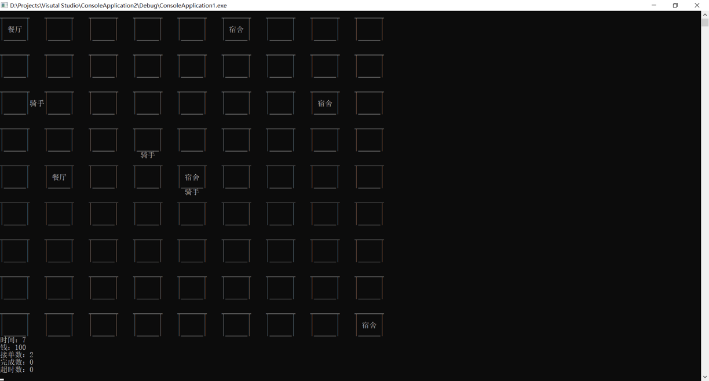
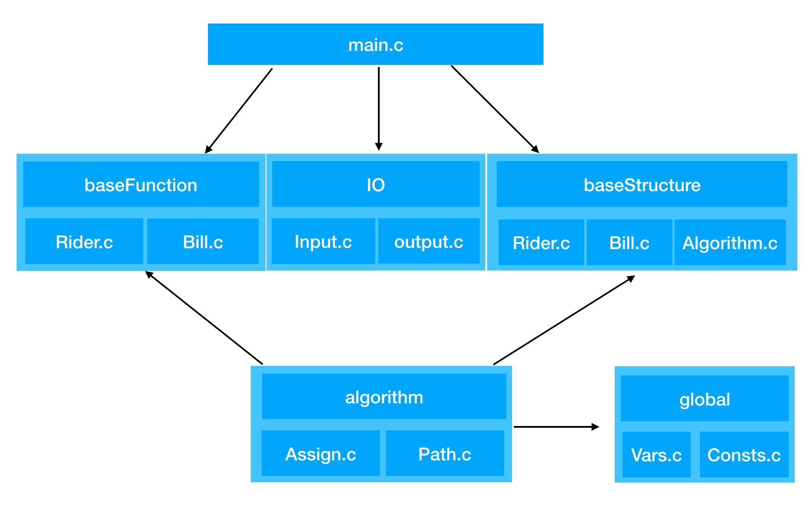

# 概要设计书

## 1.0 编码规范

#### 变量名

1. 变量名使用下划线命名方法
2. 变量定义后，写上该变量的作用及其含义
3. 变量不得使用`i,j,k,a,b,c`,包括循环变量
4. 循环变了使用`iter_i,iter_j`这种命名方法
``` c
int iter_i; // 循环
for(iter_i = 0;iter_i<10;iter_i++){
    .....
}
```
#### 常量名

1. 常量名使用大写，且常量只能使用`const`关键字定义，使用宏定义即`#define`是不被允许的。
2. 使用下划线命名方法。
``` c
const int THIS_IS_A_CONST;
```
#### 函数名

1. 函数名使用驼峰命名法
2. 函数定义后，需要使用注释写清楚，函数的输入类型，返回值类型
3. 当返回值多余一个时，使用指针传参
  
``` c
int maxOfThree(int num1,int num2,int num3){
    // 返回三个数的最大值
    return max(max(num1,num2),num3);
}
```
#### 文件名

1. 文件名使用驼峰命名法
2. 文件名格式为`name.model.c/cpp`
  
    例如 `rider.data.c`
### 目录说明

```
├── main.c      程序入口
├── README.md   项目说明文件
├── lib         自己编写的库文件
├── res         资源文件，包括图像，声音等
└── vendor      第三方资源文件
```

## 1.1 输入、输出设计

###  文件方式

#### 输入格式 < *sales.txt*

```
序号 下单时间 餐馆坐标x 餐馆坐标y 食客坐标x 食客坐标y
```

#### 输出格式 > *output.txt*

```
时间单位
账户余额
接单数
完成数
超时数
每位骑手的位置
```

### 命令行方式



## 1.2 算法设计

### 分区

### 路程设计

## 1.3 高层数据结构定义

### 全局常量定义

```
START_UP_MONEY 初始金额
HIRE_MONEY     招募一个人需要的资金
DEAD_TIME      超过DEAD_TIME时间单位后，被视为拒单
FINE_DELIVER_TIME 超时时间，第一次超时罚款
FINE_MONEY        第一次超时罚款金额
DEAD_DELIVER_TIME 超时时间，第二次超时倒闭
MONEY_PER_ONE     完成一单获得的钱
MAP_X             地图X大小
MAP_Y             地图Y大小
```

### 全局数据结构定义

#### 地图数据结构

```c
struct MapNode{
    int x,y,type; // type:代表此节点为路或者房子
}
```

#### 订单数据结构

```c
struct Bill{
    int id;             // 订单id
    int start_time;     // 订单开始时间
    int restaurant_x;   // 餐馆位置
    int restaurant_y;
    int target_x;       // 目的位置
    int target_y;
}
```

```c
struct ListBill{         // 订单链表 这里使用双链表，便于查询，实现起来应该是队列
    ListBill* pre_bill;  // 上一个订单
    Bill* cur_bill;      // 当前订单
    ListBill* next_bill; // 下一个订单
}
```

#### 骑手数据结构

```c
struct Rider{
    int id;             // 骑手id
    int position_x;     // 骑手当前位置
    int position_y;     
    Bill* current_bill; // 骑手当前订单
    ListBill* bag;       // 骑手背包数据
}
```

```c
struct ListRider{
	ListRider* pre_rider; // 前一个骑手
    Rider cur_rider;      // 当前骑手
    ListRider* next_rider;// 下一个骑手
}
```

##  1.4系统模块划分

main.c 程序入口，包括对全局对象（变量）初始化；

```c
void init(); // 初始化
```
baseFunction/Rider.c
```c
Bill getRiderCurrentBill(int rider_id); // 返回骑手当前bill
BillList getRiderBag(int rider_id);     // 返回骑手背包数据
void getRiderPosition(int rider_id,int *x,int *y) // 返回骑手当前位置，指针传参
int buyRider(); // 买骑手，返回骑手id
void riderWalk(int rider_id,int x,int y) // 移动骑手
```

baseFunction/Bill.c

```c
int getBillCostTime(int bill_id); // 获得从发出订单到现在的时间
int getBillStatus(int bill_id);   // 获得订单状态
int getBillRider(int bill_id);    // 获得订单骑手编号
void assignBill(int bill_id,int rider_id);// 派单
```

IO/Input.c

```c
Bill readBill(); // 读入一个Bill
```

IO/output.c

```c
void printStatus(); // 输出参数
void printMap();    // 输出地图数据
```

baseStructure/Rider.c

```c
void listRiderAppend(ListRider *List,Rider rider); // 骑手链表加入骑手
```

baseStructure/Bill.c

```c
void listBillAppend(ListBill *List,Bill bill) // 订单列表添加
```

algorithm/Assign.c

```c
int getProperRider(int bill_id); // 获取应当的骑手
```

algorithm/Path.c

```c
void getNextMove(int rider_id,int *x,int *y); // 获取骑手下一步位置
```

